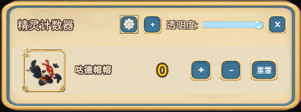

# 洛克王国异色精灵追踪器

桌面悬浮窗工具，追踪异色精灵的抓取数量，支持持久化保存。

## 功能

- **置顶半透明悬浮窗** — 始终在最前，不影响游戏操作
- **+1 / -1 / 重置计数** — 点击按钮实时更新
- **38 只异色成年体精灵预设** — 来自 `异色成年体.md`，配独立立绘
- **显示/隐藏控制** — 在设置面板中勾选需要追踪的精灵
- **持久化保存** — 数据存于本地 `data/data.json`，重启恢复
- **透明度调节** — 标题栏滑块或设置面板均可调整
- **窗口宽度可调** — 280-500px
- **自定义字体** — 猫啃网糖圆体
- **背景九宫格渲染** — 边框不变形，中心自适应拉伸

## 截图



## 运行

### 方式一：直接运行

```bash
pip install PySide6>=6.6.0
python main.py
```

### 方式二：发行包

下载 `精灵计数器.zip`，解压后双击 `精灵计数器.exe`（无需安装 Python）。

## 目录结构

```
├── main.py                 # 入口
├── models/
│   └── pokemon_data.py     # 数据模型
├── core/
│   ├── persistence.py      # JSON 读写
│   ├── app_state.py        # 状态管理
│   └── theme.py            # 主题
├── views/
│   ├── overlay_window.py   # 悬浮窗
│   ├── pokemon_card.py     # 精灵卡片
│   ├── settings_dialog.py  # 设置面板
│   ├── config_dialog.py    # 编辑对话框
│   └── components.py       # 描边文字组件
├── assets/ui/              # UI 素材
├── fonts/                  # 字体
├── LUOKE DATE/             # 精灵立绘
└── resources/              # 默认配置
```
## 开发

精灵预设图片存放于 `LUOKE DATE/`，格式为：

```
页面 宠物 立绘 {精灵名} 异色.png
```

配置位于 `resources/default_config.json`。

## License

Apache 2.0